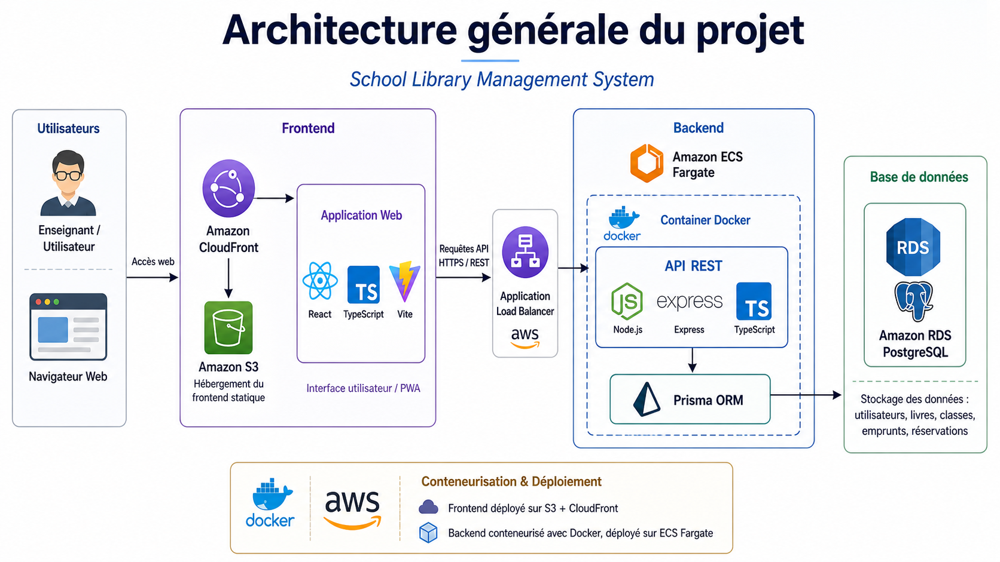

# 📚 Tech-App – School Library Management System

> Application web full-stack de gestion des emprunts de livres scolaires, déployée sur AWS.

[](https://react.dev)
[](https://www.typescriptlang.org)
[](https://nodejs.org)
[](https://www.postgresql.org)
[](https://aws.amazon.com)
[](https://www.docker.com)

---

## 🧠 Contexte du projet

**Tech-App** est une application web full-stack conçue pour simplifier et automatiser la gestion des emprunts, retours et réservations de livres scolaires.

Dans de nombreuses classes, le suivi des livres est encore réalisé manuellement, ce qui entraîne une perte de temps, des oublis, des erreurs de suivi et une difficulté à connaître rapidement l'état des ressources disponibles.

L'objectif de ce projet est de proposer une solution numérique simple, moderne et centralisée pour aider les enseignants à gérer efficacement les livres, les élèves, les classes et les emprunts.

---

## 🎯 Objectifs

- Réduire le temps consacré à la gestion manuelle des livres
- Centraliser les données liées aux écoles, classes, élèves et livres
- Faciliter les emprunts et retours grâce à l'utilisation de **QR Codes**
- Suivre en temps réel le statut des livres : disponibles, empruntés, réservés ou en retard
- Offrir une interface **responsive et PWA**, accessible depuis ordinateur ou smartphone
- Proposer un historique des emprunts avec filtres avancés

---

## 👤 Utilisateurs cibles

- Enseignants gérant des classes de livres scolaires
- Intervenants travaillant dans plusieurs écoles
- Enseignants ayant plusieurs classes selon les jours de la semaine
- Responsables pédagogiques souhaitant centraliser le suivi des livres

---

## 🏗️ Architecture générale



### Flux global

```
Utilisateur (Navigateur)
        ↓
Amazon CloudFront (CDN + HTTPS)
        ↓
Amazon S3 (Frontend React statique)
        ↓
Application Load Balancer (AWS)
        ↓
Amazon ECS Fargate (Container Docker)
        ↓
Backend Node.js / Express / TypeScript
        ↓
Prisma ORM
        ↓
Amazon RDS PostgreSQL
```

---

## ⚙️ Fonctionnalités principales

### 🏫 Gestion du référentiel scolaire
- Création et gestion des écoles et classes
- Association des classes aux jours de la semaine
- Sélection automatique de la classe du jour selon le planning de l'enseignant

### 👨‍🎓 Gestion des élèves
- Ajout, consultation et recherche d'élèves par classe
- Filtrage des données selon la classe sélectionnée

### 📘 Gestion des livres
- Création de fiches livres (titre, univers, éditeur, classe)
- Génération d'un **QR Code unique** par livre
- Suivi du statut : disponible / emprunté / réservé
- Export PDF pour impression des QR Codes

### 🔁 Gestion des emprunts et retours
- Emprunt via scan ou saisie du QR Code
- Définition d'une date de retour prévue
- Vérification automatique de la disponibilité
- Mise à jour automatique du statut après retour
- Détection des emprunts en retard

### 📌 Gestion des réservations
- Réservation d'un livre déjà emprunté
- Annulation et suivi des réservations

### 📊 Tableau de bord
- Nombre de livres disponibles / empruntés / en retard
- Nombre d'élèves, activités récentes, statistiques d'emprunts

---

## 🛠️ Stack technique

### Frontend
| Technologie | Usage |
|---|---|
| React 19 | Framework UI |
| TypeScript | Typage statique |
| Vite | Build tool |
| Tailwind CSS | Styling |
| Axios | Requêtes HTTP |
| React Router | Navigation |
| Zustand | State management |
| PWA | Application installable |

### Backend
| Technologie | Usage |
|---|---|
| Node.js 20 | Runtime |
| Express 5 | Framework HTTP |
| TypeScript | Typage statique |
| Prisma ORM 7 | Accès base de données |
| JWT | Authentification |
| bcrypt | Hashage des mots de passe |
| QRCode | Génération QR Codes |
| PDFKit | Export PDF |

### Base de données
| Technologie | Usage |
|---|---|
| PostgreSQL 18 | Base de données relationnelle |
| Amazon RDS | Hébergement managé |
| Prisma Migrations | Versioning du schéma |

### Cloud & DevOps
| Service | Usage |
|---|---|
| Amazon S3 | Hébergement frontend statique |
| Amazon CloudFront | CDN + HTTPS |
| Application Load Balancer | Routage du trafic API |
| Amazon ECS Fargate | Orchestration containers |
| Amazon ECR | Registry Docker |
| Amazon RDS PostgreSQL | Base de données managée |
| Amazon CloudWatch | Logs et monitoring |
| AWS Secrets Manager | Gestion des secrets |
| Docker | Conteneurisation |

---

## 📂 Structure du projet

```
Tech-App/
│
├── Frontend/
│   ├── src/
│   │   ├── components/
│   │   ├── pages/
│   │   ├── services/
│   │   ├── types/
│   │   ├── lib/
│   │   └── App.tsx
│   ├── public/
│   ├── package.json
│   ├── vite.config.ts
│   └── tsconfig.json
│
├── backend/
│   ├── prisma/
│   │   ├── schema.prisma
│   │   ├── prisma.config.ts
│   │   └── migrations/
│   ├── src/
│   │   ├── app.ts
│   │   ├── modules/
│   │   │   ├── auth/
│   │   │   ├── books/
│   │   │   ├── classrooms/
│   │   │   ├── loans/
│   │   │   ├── reservations/
│   │   │   ├── schools/
│   │   │   ├── students/
│   │   │   └── stats/
│   │   └── middlewares/
│   ├── Dockerfile
│   └── package.json
│
├── images/
│   └── architecture.png
│
└── README.md
```

---

## 🔐 Authentification

L'application utilise une authentification basée sur **JWT** :

- Inscription et connexion sécurisée
- Protection des routes backend via middleware
- Association des données à l'enseignant connecté
- Gestion des accès selon l'utilisateur authentifié

---

## 🧩 Modèle de données

```
User ──── School ──── Classroom ──── Student
                           │
                          Book ──── Loan
                           │
                           └──── Reservation
                           
ClassSchedule ──── User + Classroom
```

---

## 🚀 Déploiement AWS

### Frontend
1. Build avec Vite (`npm run build`)
2. Upload des fichiers statiques sur **Amazon S3**
3. Distribution mondiale via **Amazon CloudFront**

### Backend
1. Conteneurisation avec **Docker**
2. Push de l'image vers **Amazon ECR**
3. Déploiement sur **Amazon ECS Fargate**
4. Exposition via **Application Load Balancer**

### Base de données
1. **Amazon RDS PostgreSQL** (Multi-AZ recommandé en production)
2. Migrations gérées avec **Prisma**
3. Secrets stockés dans **AWS Secrets Manager**

---

## 🗺️ Roadmap

- [x] Phase 1 – Conception et analyse du besoin
- [x] Phase 2 – Mise en place technique (React, Express, Prisma)
- [x] Phase 3 – Fonctionnalités cœur (écoles, classes, élèves, livres)
- [x] Phase 4 – Emprunts, retours, réservations, QR Codes
- [x] Phase 5 – Déploiement AWS complet
- [ ] Notifications automatiques par email
- [ ] Export Excel des emprunts
- [ ] Gestion multi-rôles (admin, enseignant, intervenant)
- [ ] Application mobile
- [ ] Statistiques avancées par classe ou période

---

## 📌 Ce que ce projet m'a appris

Ce projet m'a permis de travailler sur un cycle complet de développement logiciel :

- Analyse du besoin et conception de la base de données
- Développement frontend React avec TypeScript
- Développement backend Node.js avec architecture modulaire
- Authentification JWT et gestion des erreurs
- Intégration avec Prisma ORM
- Conteneurisation Docker
- Déploiement cloud complet sur AWS
- Mise en production d'une application full-stack

---

## 📬 Contact

Projet réalisé dans un cadre pédagogique et technique.

Pour toute question ou suggestion, vous pouvez me contacter via **GitHub** ou **LinkedIn**.

---

## 📝 Licence

Projet réalisé dans un cadre pédagogique.
